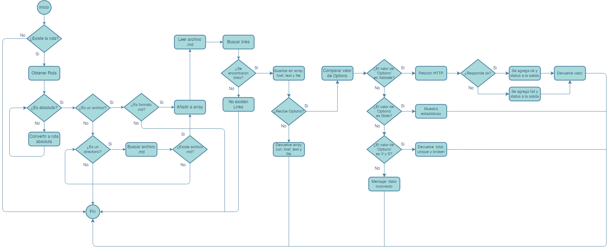

# Markdown Links 
#### md-links es una libreria para Node.js que facilita la lectura de archivos Markdown y la extracción de enlaces para verificar su estado en línea. Con esta libreria, puedes automatizar la tarea de comprobar la validez de los enlaces en tus documentos Markdown,

#### Características clave:

* `Extracción de enlaces:` La libreria es capaz de analizar archivos Markdown y extraer todos los enlaces presentes en ellos.

* `Verificación del estado en línea:` Utilizando peticiones HTTP, la libreria realiza solicitudes a cada uno de los enlaces extraídos para determinar su estado en línea. Puede determinar si un enlace está funcionando correctamente (estado "OK") o si ha fallado (estado "Not Found").

* `Entrega de estadísticas:` La biblioteca también permite mostrar estadísticas relacionadas con la cantidad de enlaces totales, enlaces únicos y enlaces rotos.

# install
``` npm i md-links-005```
# usage
### Al ejecutar lo siguiente en la línea de comandos:
``` mdlinks file.md --validate```
#### md-links retorna un conjunto de texto que contiene información correspondiente a cada link encontrado: 

``` href: https://es.wikipedia.org/wiki/Javascript
    text: Javascript
    file: C:\Users\User\Files\README.md
    
    href: https://nodejs.org/
    text: Node.js
    file: C:\Users\User\Files\Links.md
```
### Cuando ejecutamos:
``` mdlinks file.md --stats```
#### md-links retorna a) el número total de links encontrados en el archivo y b) el número de links únicos (que no se repiten) presentes en el archivo. 

```
Total: 3 , Unique: 3
```
### y finalmente, al ejecutar:
``` mdlinks file.md --validate --stats```
#### md-links retorna a) el número total de links encontrados en el archivo y b) el número de links únicos (que no se repiten) presentes en el archivo y c) el número total de los links que no funcionan correctamente.

```
Total: 3 , Unique: 3, Broken: 1
```

# Related
- [md-links-sr](https://www.npmjs.com/package/md-links-sr)
- [markdown-it](https://www.npmjs.com/package/markdown-it)
# Mantainers 
- [GithubProfile](https://github.com/iraprojects/)

# Visual representation of the process: 
